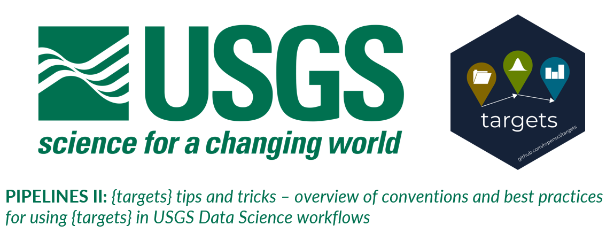

In this course, you will learn the common conventions and best practices used by USGS Data Science when building pipelines using the R package `targets`. There are also a number of tips and tricks for how to debug and construct `targets` pipelines strategically.

To get started click on `course-instructions.md`.

This repository is a static version of the targets training course: *USGS targets tips and tricks: overview of conventions and best practices for using targets in USGS Data Science workflows*. That course has been archived as [version 1.0.0](https://github.com/padilla410/ds-pipelines-targets-2-course-static/releases/tag/1.0.0).
