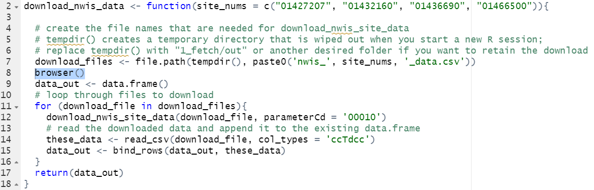
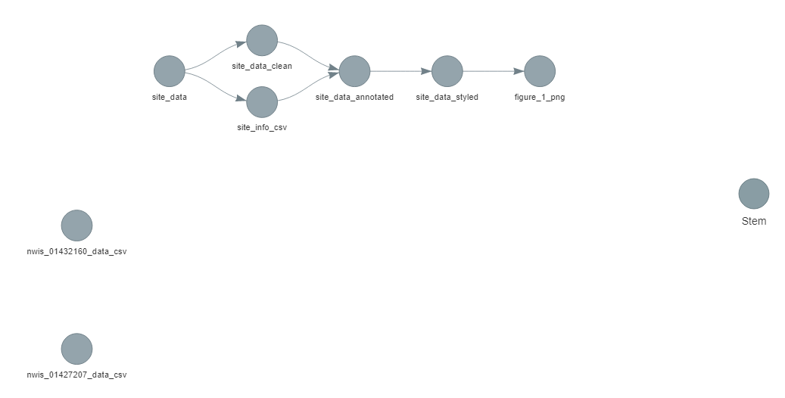
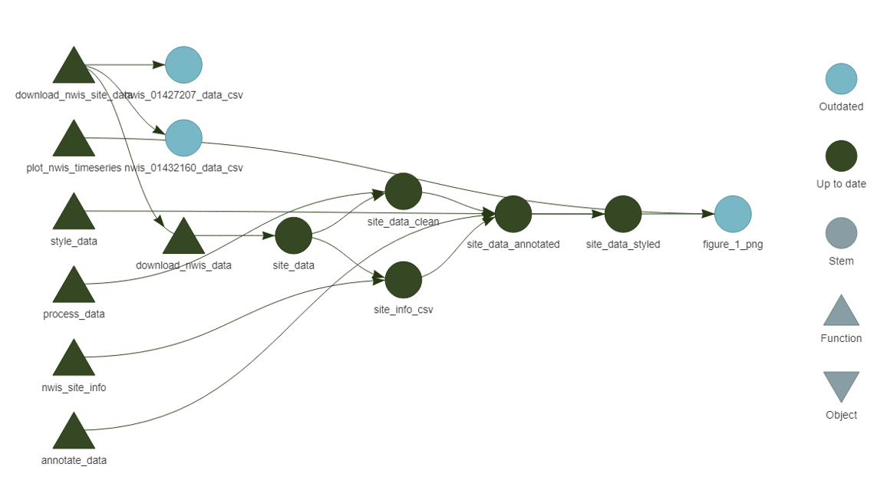
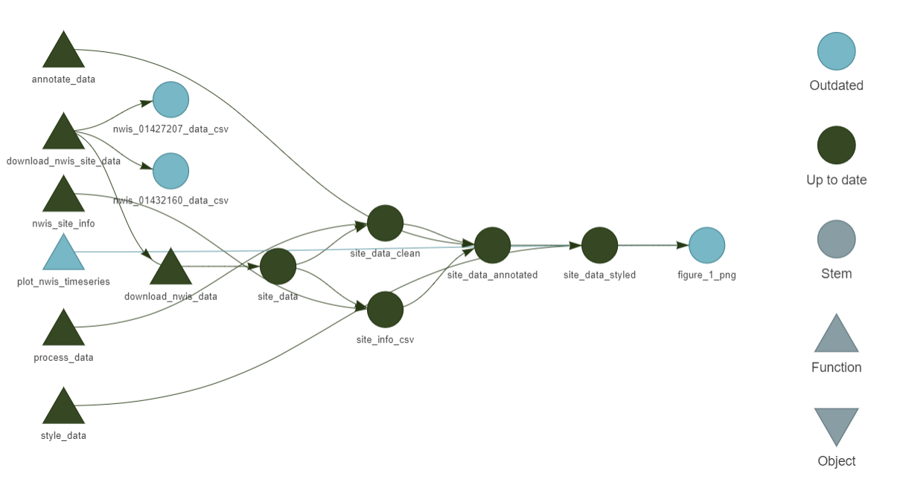
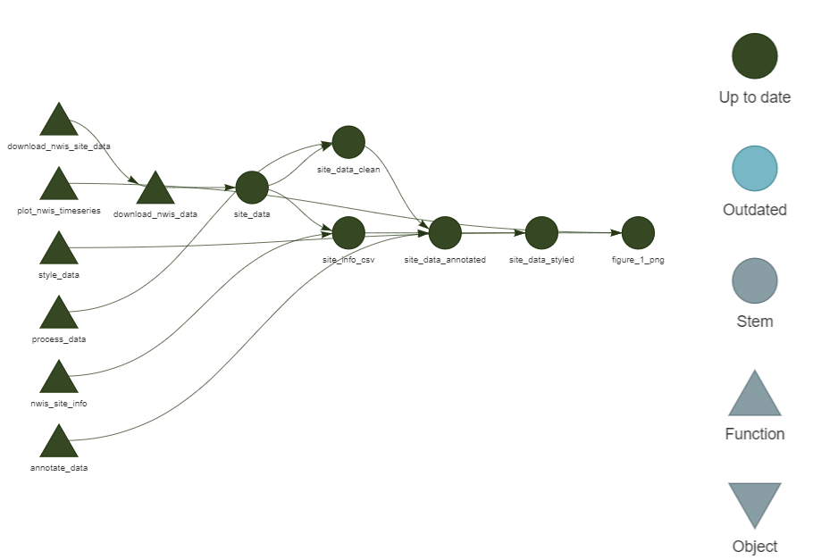
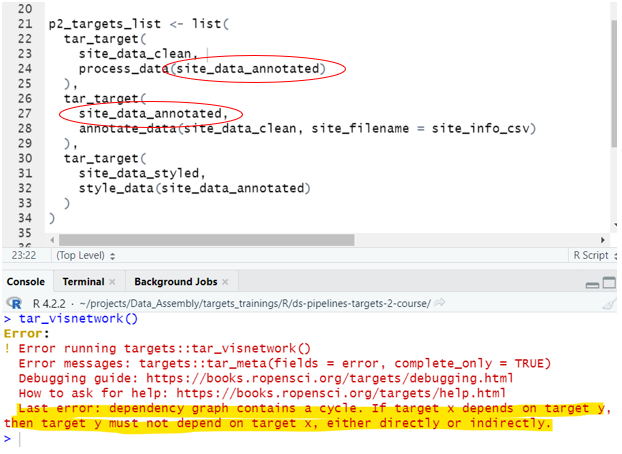
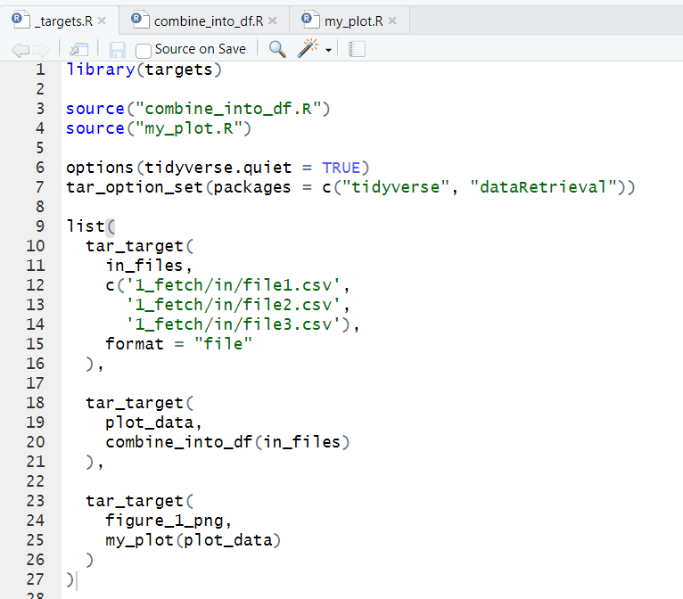
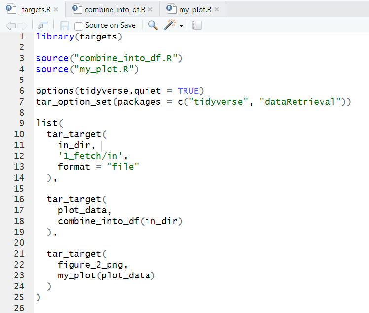

<details open>
<summary><h2>Overview</h2></summary>

**Welcome to the second installment of "introduction to data pipelines"** at USGS!! :sparkles:

We're assuming you were able to navigate through the [intro-to-targets-pipelines](https://github.com/DOI-USGS/ds-pipelines-targets-1-course) course and that you learned a few things about organizing your code for readability, re-use, and collaboration. You were also introduced to two key things through the makefile: a way to program connections between functions, files, and phases and the concept of a dependency manager that skips parts of the workflow that don't need to be re-run. 

---
### Recap of pipelines I

First, a recap of key concepts that came from [intro-to-targets-pipelines](https://github.com/DOI-USGS/ds-pipelines-targets-1-course) :point_down:
- Data science work should be organized thoughtfully. As Jenny Bryan notes, "File organization and naming are powerful weapons against chaos".
- Capture all of the critical phases of project work with descriptive directories and function names, including how you "got" the data.
- Turn your scripts into a collection of functions, and modify your thinking to connect outputs from these functions ("targets") to generate your final product.
- "Skip the work you don't need" by taking advantage of a dependency manager. There was a video that covered a bit of `make`, and you were asked to experiment with `targets`.
- Invest in _efficient_ reproducibility to scale up projects with confidence. 

This last concept was not addressed directly, but we hope that the small exercise of seeing rebuilds in action got you thinking about projects that might have much more lengthy steps (e.g., several downloads or geo-processing tasks that take hours instead of seconds).

### What's ahead in pipelines II

In this training, the focus will be on conventions and best practices for making better, smarter pipelines for USGS Data Science projects. You'll learn new things here that will help you refine your knowledge from the first class and put it into practice. Let's get started!


:keyboard: Activity: Add collaborators to get started.

As with pipelines I, please invite a few collaborators to your repository so they can easily comment and review in the future. In the :gear: Settings widget at the top of your repo, select "Manage access". Go ahead and invite your course instructor. It should look something like this: 


<hr>

### Set up your local environment before continuing

During the course, we will ask you to build the pipeline, explore how to troubleshoot, and implement some of the best practices you are learning. To do this, you will work with the pipeline locally and commit/push your changes to GitHub for review. 

See details below for how to get started working with code and files that exist within the course repsository:

---

Open a git bash shell (Windows:diamond_shape_with_a_dot_inside:) or a terminal window (Mac:green_apple:) and change (`cd`) into the directory you work in for projects in R (for me, this is `~/Documents/R`). There, clone the repository and set your working directory to the new project folder that was created:

```
git clone git@github.com:<your-username-here>/ds-pipelines-targets-2-course-static.git
cd ds-pipelines-targets-2
```

You can open this project in RStudio by double-clicking the .Rproj file in the `ds-pipelines-targets-2` directory.

:star: Now you have the repository locally! Follow along with the commands introduced and make changes to the code as requested throughout the remainder of the course.

</details>

<hr> 

<details><summary><h2>How to get past the gotchas without getting gotten again</h2></summary>

In this course, we're going to go one by one through a series of tips that will help you avoid common pitfalls in pipelines. These tips will help you in the next sections and in future work. A quick list of what's to come:

- :mag: How to debug in a pipeline
- :eyes: Visualizing and understanding the status of dependencies in a pipeline
- :speech_balloon: `tar_visnetwork()` and `tar_outdated()` to further interrogate the status of pipeline targets
- :arrows_clockwise: What is a cyclical dependency and how do I avoid it?
- :warning: Undocumented file output from a function 
- :open_file_folder: Using a directory as a dependency 
- :clipboard: How do I know when to use an object vs a file target or even use a target at all? 
- :gear: USGS Data Science naming conventions
- :unlock: Final tips for smart pipelining

<hr>

### How to inspect parts of the pipeline and variables within functions

If you've written your own functions or scripts before, you may have run into the red breakpoint dot :red_circle: on the left side of your script window:


Breakpoints allow you to run a function (or script) up until the line of the breakpoint, and then the evaluation pauses. You are able to inspect all variables available at that point in the evaluation, and even step carefully forward one line at a time. It is out of scope of this exercise to go through exactly how to use debuggers, but they are powerful and helpful tools. It would be a good idea to [read up on them](https://support.rstudio.com/hc/en-us/articles/205612627-Debugging-with-RStudio) if you haven't run into breakpoints yet. 

In `targets`, you can't set a breakpoint in the "normal" way, which would be clicking on the line number after you sourced the script. Instead, you need to use the other method for debugging in R, which requires adding the function call `browser()` to the line where you'd like the function call to stop and specifying an additional argument when you call `tar_make()`. 

:warning: Check your RStudio version (go to the Help menu and click About RStudio). If you have a version earlier than v2023.06.0+421, you may want to consider [updating RStudio](https://www.rstudio.com/products/rstudio/download/#download) before proceeding to have the smoothest experience in debugging mode. :warning:

---

You have a working, albeit brittle, pipeline in your course repository. You can try it out with `targets::tar_make()`. This pipeline has a number of things you'll work to fix later, but for now, it is a useful reference. The pipeline contains a `_targets.R` makefile and several functions defined in `.R` files. 

So, if you wanted to look at what `download_files` were created within the `download_nwis_data()` function, you could set a breakpoint by adding `browser()` to the `"1_fetch/src/get_nwis_data.R"` file (make sure to hit save for changes to take effect!). Hint: to quickly navigate to this function source code from your makefile, you can put your cursor on the name of the function then click F2 and it will take you to the correct location in the corresponding source file!



There is one more step to get your breakpoint to work in `targets`. You will need to add `callr_function = NULL` to your `tar_make()` call. When you run `tar_make(callr_function = NULL)`, you will land right in the middle of line 8. Give it a try on your own.

To navigate while in browser mode, you can use the buttons at the top of your console pane:


---

:keyboard: Place a `browser()` in the `for` loop of the `download_nwis_data()` function. Build the pipeline and compare the size of `data_out` through each iteration of the loop using the debugger navigational features. When you are done, don't forget to remove the `browser()` command from that function and then save the R script. Then, consider where you think you might find `browser()` handy in future pipelines. 

<hr>

### Visualizing and understanding the status of dependencies in a pipeline

Seeing the structure of a pipeline as a visual is powerful. Viewing connections between targets and the direction data is flowing in can help you better understand the role of pipelines in data science work. Once you are more familiar with pipelines, using the same visuals can help you diagnose problems. 

Below is a `_targets.R` file that is very similar to the one you have in your code repository (the library, option configurations, and `source` calls were removed for brevity, but they are unchanged):
```r

p1_targets_list <- list(
  tar_target(
    site_data,
    download_nwis_data(),
  ),
  tar_target(
    site_info_csv,
    nwis_site_info(fileout = "1_fetch/out/site_info.csv", site_data),
    format = "file"
  ),
  tar_target(
    nwis_01427207_data_csv,
    download_nwis_site_data(fileout = '1_fetch/out/nwis_01427207_data.csv'),
    format = "file"
  ),
  tar_target(
    nwis_01432160_data_csv,
    download_nwis_site_data(fileout = '1_fetch/out/nwis_01432160_data.csv'),
    format = "file"
  )
)

p2_targets_list <- list(
  tar_target(
    site_data_clean, 
    process_data(site_data)
  ),
  tar_target(
    site_data_annotated,
    annotate_data(site_data_clean, site_filename = site_info_csv)
  ),
  tar_target(
    site_data_styled,
    style_data(site_data_annotated)
  )
)

p3_targets_list <- list(
  tar_target(
    figure_1_png,
    plot_nwis_timeseries(fileout = "3_visualize/out/figure_1.png", site_data_styled),
    format = "file"
  )
)

```

The only difference between your `_targets.R` file and the one above is that two file targets (`nwis_01427207_data_csv` and `nwis_01432160_data_csv`) were added. `download_nwis_site_data()`, the function that is used to create `nwis_01427207_data_csv` and `nwis_01432160_data_csv`, _has not changed_. This point is important because any other targets in the pipeline that call `download_nwis_site_data()`, such as `site_data`, will remain up-to-date and will be skipped when running `tar_make()`.

The functions that are used to create each target (`download_nwis_site_data()`, `style_data`, etc.)  have not been changed. , but there were no changes to the functions, since `download_nwis_site_data()` already exists and is used to create a single file that contains water monitoring information for a single site. 

---

#### tar_glimpse()

The `targets` package has a nice function called `tar_glimpse()` that we haven't covered yet (if you get an error when you try to use it, run `install.packages("visNetwork")` and then try again). It produces a dependency diagram for the target(s) you pass to the `allow` argument (it will show all of them by default). For this _modified_ `targets.R` file, calling that function with the default arguments produces the following diagram:
```r
targets::tar_glimpse()
```


If you run the same command, you'll see something similar but the two new files won't be included. 

---

Seeing this diagram helps develop a greater understanding of some of the earlier concepts from [intro-to-targets-pipelines](https://github.com/DOI-USGS/ds-pipelines-targets-1-course). Here, you can clearly see the connection between `site_data` and `figure_1_png`. The figure_1 plot _needs_ all of the previous steps to have run in order to build. The arrows communicate the connections (or "dependencies") between targets, and if a target doesn't have any arrows connected to it, it isn't depended _on_ by another target and it doesn't depend _on_ any another targets. The two new .csv files are both examples of this, and in the image above they are floating around with no connections. A floater target like these two will still be built by `tar_make()` if they are included in the final target list (e.g., here they appear in `p1_targets_list` which is included in the final target list returned at the end of `_targets.R`)

The diagram also shows how the inputs of one function create connections to the output of that function. `site_data` is used to build `site_data_clean` (and is the only input to that function) and it is also used as an input to `"1_fetch/out/site_info.csv"`, since the `nwis_site_info()` function needs to know what sites to get information from. These relationships result in a split in the dependency diagram where `site_data` is directly depended on by two other targets. 

---

#### tar_manifest()

Another useful technique for examining your pipeline connections is to use `tar_manifest()`, which returns a data.frame of information about the targets. While visual examination gives a complete overview, sometimes it is also useful to have programmatic access to your target names. Below is the table that is returned from `tar_manifest()` (remember that yours might be slightly different because it won't include the two new files). 

```r
tar_manifest()

# A tibble: 8 x 3
  name                  command                                                                            pattern
  <chr>                 <chr>                                                                              <chr>  
1 site_data             "download_nwis_data()"                                                             NA     
2 nwis_01432160_data_c~ "download_nwis_site_data(\"1_fetch/out/nwis_01432160_data.csv\")"                  NA     
3 nwis_01427207_data_c~ "download_nwis_site_data(\"1_fetch/out/nwis_01427207_data.csv\")"                  NA     
4 site_data_clean       "process_data(site_data)"                                                          NA     
5 site_info_csv         "nwis_site_info(fileout = \"1_fetch/out/site_info.csv\",  \\n     site_data)"      NA     
6 site_data_annotated   "annotate_data(site_data_clean, site_filename = site_info_csv)"                    NA     
7 site_data_styled      "style_data(site_data_annotated)"                                                  NA     
8 figure_1_png          "plot_nwis_timeseries(fileout = \"3_visualize/out/figure_1.png\",  \\n     site_d~ NA 
```

---

<hr>

### Using tar_visnetwork() and tar_outdated() to explore status of pipeline targets

In the image contained within the previous comment, all of the shapes are circles of the same color. `tar_glimpse()` is useful to verify your pipeline connections, but once you start building your pipeline `tar_visnetwork()` creates a dependency diagram with more information and styles the shapes in ways to signify which targets are out of date or don't need to rebuild. 

We've put some fragile elements in the pipeline that will be addressed later, but if you were able to muscle through the failures with multiple calls to `tar_make()`, you likely were able to build the figure at the end of the dependency chain. For this example, we'll stop short of building the `figure_1_png` target by calling `tar_make('site_data_styled')` instead to illustrate an outdated target. 

#### Which targets are incomplete/outdated?

The output of `tar_visnetwork()` after running `tar_make('site_data_styled')` (and having never built all targets by running `tar_make()` with no inputs) looks like this:


Only the colors have changed from the last example, signifying that the darker targets are "complete", but that `figure_1_png` and the two `data.csv` files still don't exist. 

The `targets` package has a useful function called `tar_outdated()` which will list the incomplete targets that need to be updated in order to satisfy the output (once again, the default for this function is to reference all targets in the pipeline).

```r
tar_outdated()
[1] "nwis_01432160_data_csv" "nwis_01427207_data_csv" "figure_1_png"                
```
This output tells us the same thing as the visual, namely that these three targets :point_up: are incomplete/outdated.

A build of the figure with `tar_make('figure_1_png')` will update the target dependencies, result in a `tar_visnetwork()` output which darkens the fill color on the `figure_1_png` shape, and cause a call to `tar_outdated("figure_1_png")` to result in an empty character vector, `character(0)`, letting the user know the target is not outdated. 

---

The `figure_1_png` target can become outdated again if there are any modifications to the upstream dependencies (follow the arrows in the diagram "upstream") or to the function `plot_nwis_timeseries()`. Additionally, a simple update to the value of one of the `"fixed"` arguments will cause the `figure_1_png` target to become outdated. Here the `height` argument was changed from 7 to 8:
```
tar_visnetwork("3_visualize/out/figure_1.png")
```



In the case of fixed arguments, changing the argument names, values, _or even the order they are specified_ will create a change in the function definition and cause the output target to be considered outdated. Adding comments to the function code does not cause the function to be seen as changed.

---

:keyboard: using `tar_visnetwork()` and `tar_outdated()` can reveal unexpected connections between the target and the various dependencies. Comment on some of the different information you'd get from `tar_visnetwork()` that wouldn't be available in the output produced by `tar_glimpse()` or `tar_manifest()`.

<hr>

### What are cyclical dependencies and how to avoid them?

Using `tar_visnetwork()` shows the dependency diagram of the pipeline. As a reminder, here is the `tar_visnetwork` diagram for our current pipeline:



As a reminder, the direction of the arrows capture the dependency flow, and `site_data` sits on the left, since it is the first target that needs to be built. 

Also note that there are no backward looking arrows. What if `site_data` relied on `site_data_styled`? In order to satisfy that relationship, an arrow would need to swing back up from `site_data_styled` and connect with `site_data`. Unfortunately, this creates a [cyclical dependency](https://en.wikipedia.org/wiki/Circular_dependency) since changes to one target change the other target and changes to that target feed back and change the original target...so on, and so forth...

This potentially infinite loop is confusing to think about and is also something that dependency managers can't support and won't be able to visualize. If your pipeline contains a cyclical dependency, you will get an error when you try to run `tar_make()` or `tar_visnetwork()` that says "dependency graph contains a cycle". We won't say much more about this issue here, but note that in the early days of building pipelines if you run into the cyclical dependency error, this is what's going on. Here is an example of what that may look like:



<hr>

### Creating side-effect targets or undocumented inputs

Moving into a pipeline-way-of-thinking can reveal some suprising habits you created when working under a different paradigm. Moving the work of scripts into functions is one thing that helps compartmentalize thinking and organize data and code relationships, but smart pipelines require even more special attention to how functions are designed. 

#### Side-effect targets

It is tempting to build functions that do several things; perhaps a plotting function also writes a table, or a data munging function returns a data.frame, but also writes a log file. If a function creates a file or output that is not returned by the command (i.e., it is a "side-effect" output), the file is untracked by the dependency manager because it has no `"command"` to specify how it is built. If the side-effect file is relied upon by a later target, changes to the side-effect target will indeed trigger a rebuild of the downstream target, but the dependency manager will have no way of knowing when the side-effect target itself should be rebuilt. :no_mobile_phones:

Maybe the above doesn't sound like a real issue, since the side-effect target would be updated every time the other **explicit** target it is paired with is rebuilt. But this becomes a scary problem (and our first real gotcha!) if the **explicit** target is not connected to the critical path of the final sets of targets you want to build, but the side-effect target is. What this means is that _even if the explicit target is out of date_, it will not be rebuilt because building _this_ target is unnecessary to completing the final targets (remember "skip the work you don't need" :arrow_right_hook:). The dependency manager doesn't know that there is a hidden rule for updating the side-effect target and that this update is necessary for assuring the final targets are up-to-date and correct. :twisted_rightwards_arrows:

Side-effect targets can be used effectively, but doing so requires a good understanding of implications for tracking them and advanced strategies on how to specify rules and dependencies in a way that carries them along. :ballot_box_with_check:
---

#### Undocumented inputs
Additionally, it is tempting to code a filepath within a function which has information that needs to be accessed in order to run. This seems harmless, since functions are tracked by the dependency manager and any changes to those will trigger rebuilds, right? Not quite. If a filepath like `"1_fetch/in/my_metadata.csv"` is specified as an argument to a function but is not also a target in the makefile recipe, any changes to the `"1_fetch/in/my_metadata.csv"` will go unnoticed by the dependency manager, since the string that specifies the file name remains unchanged. The system isn't smart enough to know that it needs to check whether that file has changed. 

To depend on an input file, you first need to set up a simple target whose command returns the filepath of said file. Like so:

```
tar_target(my_metadata_csv, "1_fetch/in/my_metadata.csv", format = "file")
```

Now say you had a function that needed this metadata input file for plotting because it contains latitude and longitude for your sites. To depend on this file as input, do this:
```
tar_target(map_of_sites, make_a_map(metadata_file = my_metadata_csv))
```

but *NOT* like this (this would be the method that doesn't track changes to the file!):
```
tar_target(map_of_sites, make_a_map(metadata_file = "1_fetch/in/my_metadata.csv"))
```

As a general rule, do not put filepaths in the body of a function. :end:

<hr>

### How to depend on a directory for changes

You might have a project where there is a directory :file_folder: with a collection of files. To simplify the example, assume all of the files are `.csv` and have the same format. As part of the hypothetical project goals, these files need to be combined and formatted into a single plottable data.frame. 

In a data pipeline, we'd want assurance that any time the number of files changes, we'd rebuild the resulting data.frame. Likewise, if at any point the _contents_ of any one of the files changes, we'd also want to re-build the data.frame. 

This hypothetical example could be coded as: 



While this solution would work, it is less than ideal because it doesn't scale well to **many** files, nor would it adapt to new files coming into the `1_fetch/in` directory :file_folder: (the pipeline coder would need to manually add file names to the `in_files` target).

---

Lucky for us, the `targets` package can handle having a directory as a target. If you add a target for a directory, the pipeline will track changes to the directory and will rebuild if it detects changes to the contents a file, the name of a file, or the number of files in the directory changes. 

To track changes to a directory, add the directory as a file target (see the `in_dir` target below). Important - you must add `format = "file"`! Then, you can use that directory as input to other functions. Note that you'd also need to modify your `combine_into_df` function to use `dir(in_dir)` to generate the file names since `in_dir` is just the name of the directory. 




Yay! :star2: This works because a change to any one of the files (or an addition/deletion of a file) in `1_fetch/in` will result in a rebuild of `in_dir`, which would cause a rebuild of `plot_data`. 

<hr>

### What to do when you want to specify a non-target input to a command

Wow, we've gotten this far and haven't written a function that accepts anything other than an object target or a file target. I feel so constrained!

In reality, R functions have all kinds of other arguments, from logicals (TRUE/FALSE), to characters that specify which configurations to use. 

The example in your working pipeline creates a figure, called `3_visualize/out/figure_1.png`. Unless you've made a lot of modifications to the `plot_nwis_timeseries()` function, it has a few arguments that have default values, namely `width = 12`, `height = 7`, and `units = 'in'`. Nice, you can control your output plot size here!

We can add those to the makefile like so
```r
tar_target(
  figure_1_png,
  plot_nwis_timeseries(fileout = "3_visualize/out/figure_1.png", site_data_styled,
                       width = 12, height = 7, units = 'in'),
  format = "file"
)
```

and it works! :star2:

---

What if we wanted to specify the same plot sizes for multiple plots? We could pass in `width = 12`, `height = 7`, and `units = 'in'` each time `plot_nwis_timeseries` is called _OR_ we can create R objects in the makefile that define these configurations and use them for multiple targets. 

You can add these
```r
p_width <- 12
p_height <- 7
p_units <- "in"
```

to your `_targets.R` file and then call them in the plot command for your targets, such as
```r
tar_target(
  figure_1_png,
  plot_nwis_timeseries(fileout = "3_visualize/out/figure_1.png", site_data_styled,
                       width = p_width, height = p_height, units = p_units),
  format = "file"
)
```

Objects used in the command for `tar_target()` need to be created somewhere before they are called. It is usually a good idea to put configuration info near the top of the makefile. I would suggest adding the code to create these three objects immediately after your `tar_option_set()` call.

---

Another example of when this object (rather than target) pattern comes in handy is when we want to _force_ a target to rebuild. Note that in the example below, we are writing the `command` for this target by putting two lines of code between `{}` rather than calling a separate custom function. You can do this for any target, but it is especially useful in this application when we just have two lines of code to execute.

```r
library(targets)

list(
  tar_target(
    work_files,
    {
      dummy <- '2021-04-19'
      item_file_download(sb_id = "4f4e4acae4b07f02db67d22b", 
                         dest_dir = "1_fetch/tmp",
                         overwrite_file = TRUE)
    },
    format = "file",
    packages = "sbtools"
  )
)
```
By adding this `dummy` object to our `command` argument for the `work_files` target, we can modify the dummy contents any time we want to force the update of `work_files`. Updating the `dummy` argument to today's date allows us to simultaneously force the update and record when we last downloaded the data from ScienceBase. You may see the use of these `dummy` arguments in spots where there is no other trigger that would cause a rebuild, such as pulling data from a remote webservice or website when `targets` has no way of knowing that new data are available on the same service URL.

---

</details>

<hr>

<details><summary><h2>Strategies for defining targets in data pipelines</h2></summary>

### How to make decisions on how many targets to use and how targets are defined

We've covered a lot of content about the rules of writing good pipelines, but pipelines are also very flexible! Pipelines can have as many or as few targets as you would like, and targets can be as big or as small as you would like. The key theme for all pipelines is that they are reproducible codebases to document your data analysis process for both humans and machines. In this next section, we will learn about how to make decisions related to the number and types of targets you add to a pipeline.

### Background 
Isn't it satisfying to work through a fairly lengthy data workflow and then return to the project and it _just works_? For the past few years, we have been capturing the steps that go into creating results, figures, or tables appearing in data visualizations or research papers. There are recipes for reproducibility used in complex, collaborative modeling projects, such as in [this reservoir temperature modeling pipeline](https://code.usgs.gov/wma/wp/res-temperature-process-models) and in [this pipeline to manage downloads of forecasted meteorological driver data](https://code.usgs.gov/wma/wp/forecasted-met-drivers). _Note that you need to be able to access internal USGS websites to see these examples and these were developed early on in the Data Science adoption of `targets` so may not showcase all of our adopted best practices_.

---

Here is a much simpler example that was used to generate **Figure 1** from [Water quality data for national-scale aquatic research: The Water Quality Portal](https://agupubs.onlinelibrary.wiley.com/doi/full/10.1002/2016WR019993) (published in 2017):

```r
library(targets)

## All R files that are used must be listed here:
source("R/get_mutate_HUC8s.R")
source("R/get_wqp_data.R")
source("R/plot_huc_panel.R")

tar_option_set(packages = c("dataRetrieval", "dplyr", "httr", "lubridate", "maps",
                            "maptools", "RColorBrewer", "rgeos", "rgdal", "sp", "yaml"))

# Load configuration files
p0_targets_list <- list(
  tar_target(map_config_yml, "configs/mapping.yml", format = "file"),
  tar_target(map_config, yaml.load_file(map_config_yml)),
  tar_target(wqp_config_yml, "configs/wqp_params.yml", format = "file")
  tar_target(wqp_config, yaml.load_file(wqp_config_yml))
)

# Fetch data
p1_targets_list <- list(
  tar_target(huc_map, get_mutate_HUC8s(map_config)),
  tar_target(phosphorus_lakes, get_wqp_data("phosphorus_lakes", wqp_config, map_config)),
  tar_target(phosphorus_all, get_wqp_data("phosphorus_all", wqp_config, map_config)),
  tar_target(nitrogen_lakes, get_wqp_data("nitrogen_lakes", wqp_config, map_config)),
  tar_target(nitrogen_all, get_wqp_data("nitrogen_all", wqp_config, map_config)),
  tar_target(arsenic_lakes, get_wqp_data("arsenic_lakes", wqp_config, map_config)),
  tar_target(arsenic_all, get_wqp_data("arsenic_all", wqp_config, map_config)),
  tar_target(temperature_lakes, get_wqp_data("temperature_lakes", wqp_config, map_config)),
  tar_target(temperature_all, get_wqp_data("temperature_all", wqp_config, map_config)),
  tar_target(secchi_lakes, get_wqp_data("secchi_lakes", wqp_config, map_config)),
  tar_target(secchi_all, get_wqp_data("secchi_all", wqp_config, map_config)),
)

# Summarize the data in a plot
p2_targets_list <- list(
  tar_target(
    multi_panel_constituents_png,
    plot_huc_panel(
      "figures/multi_panel_constituents.png", huc_map, map_config, 
      arsenic_lakes, arsenic_all, nitrogen_lakes, nitrogen_all, 
      phosphorus_lakes, phosphorus_all, secchi_lakes, secchi_all, 
      temperature_lakes, temperature_all
    ),
    format = "file")
)

# Combine all targets into a single list
c(p0_targets_list, p1_targets_list, p2_targets_list)
```

This makefile recipe generates a multipanel map, which colors [HUC8 watersheds](http://dep.wv.gov/WWE/getinvolved/sos/Documents/Basins/HUCprimer.pdf) according to how many sites within the watershed have data for various water quality constituents:


---

The `"figures/multi_panel_constituents.png"` figure takes a while to plot, so it is a somewhat "expensive" target to iterate on when it comes to style, size, colors, and layout (it takes 3 minutes to plot for me). But the plotting expense is dwarfed by the amount of time it takes to build each water quality data "object target", since `get_wqp_data` uses a web service that queries a large database and returns a result; the process of fetching the data can sometimes take over thirty minutes (`nitrogen_all` is a target that contains the locations of all of the sites that have nitrogen water quality data samples). 

Alternatively, the `map_config*` object above builds in a fraction of second, and contains some simple information that is used to fetch and process the proper boundaries with the `get_mutate_HUC8s` function, and includes some plotting details for the final map (such as plotting color divisions).

This example, although dated, represents a real project that caused us to think carefully about how many targets we use in a recipe and how complex their underlying functions are. Decisions related to targets are often motivated by the intent of the pipeline. In the case above, our intent at the time was to capture the data and processing behind the plot in the paper in order to satisfy our desire for reproducibility. 

---


### Target expense

In general, if building part of a pipeline is "expensive" (i.e., takes more than a trivial amount of time for a computer to execute), it should be a separate target. In the example above :point_up:, expensive sections included fetching data and plotting. 

Additional reasons to create a target include:
- If some element in the pipeline may fail (such as downloading data from the internet), isolating this brittle part of the project as a target with a corresponding function makes it faster to get past. This is because your target focuses on accomplishing _only_ the brittle step, instead of, for example, also attempting to process and plot downloaded data all within the same function.
- Sometimes a target is created in order to make it easier to defer a decision for later. If we have an expensive geoprocessing task but the methods for the final way of summarizing the results is in flux, it might make sense to break this function and target into two functions and two targets: the major parts of the geoprocessing step in one function-target pair, and the smaller summary process in the second. 
- Targets are easy to inspect and dig into (e.g., `tar_load(my_target)`, or reading in a file that was created). If there is an intermediate step in a workflow that will likely need to be examined, it may deserve a target.
- Lastly, if a configuration or value is shared accross many other targets, the configuration itself might deserve a stand alone target, even if generating that target is computationally cheap. In our water quality data pull example, the `wqp.config` target is an example of a shared configuration. Within that target, there is (among other things) a string that specifies how lake sites are queried in the web service. If that query parameter changes in the future, making the change to the file behind the `wqp.config` target would propagate into the necessary updates to the data pulls run with `get_wqp_data`.

---

But of course there is a cost to creating many targets: you'll end up typing a lot more, a lot of additional files will be created that need to be stored, and the addition of more targets makes it is harder to navigate the `makefile`.

</details>

<hr>

<details><summary><h2>Refactor the existing pipeline to use more effective targets</h2></summary>

:keyboard: Activity: Make modifications to the working, but less than ideal, pipeline that exists within your course repository

Within the course repo you should see only a `_targets.R` makefile and directories with code or placeholder files for each phase. You should be able to run `tar_make()` and build the pipeline, although it may take numerous tries, since some parts of this new workflow are brittle. Some hints to get you started: the `site_data` target is too big, and you should consider splitting it into a target for each site, perhaps using the `download_nwis_site_data()` function directly to write a file. Several of the `site_data_` targets are too small and it might make sense to combine them.

---

When you are happy with your newer, better workflow, create a pull request with your changes and assign your designated course instructor as a reviewer. Add a comment to your own PR with thoughts on how you approached the task, as well as key decisions you made.

Recall that you should not be committing any build artifacts of the pipeline to GitHub, so make sure that your `*/out/*` folders are included in your `.gitignore` file.

You should create a local branch called "refactor-targets" and push that branch up to the "remote" location (which is the github host of your repository). We're naming this branch "refactor-targets" to represent concepts in this section of the lab. In the future you'll probably choose branch names according to the type of work they contain - for example, `"pull-oxygen-data"` or `"fix-issue-17"`.

```
git checkout -b refactor-targets
git push -u origin refactor-targets
```

<hr>
<h3 align="center">A human will interact with your pull request once you assign them as a reviewer</h3>

</details>

<hr>

<details><summary><h2>Learn the differences between different types of targets</h2></summary>

### Targets

"Targets" are the main things that the `targets` package interacts with (if the name hadn't already implied that :zany_face:). They represent things that are made (they're also the vertices of the [dependency graph](http://en.wikipedia.org/wiki/Dependency_graph)). If you want to make a plot called `plot.pdf`, then that's a target. If you depend on a dataset called `data.csv`, that's a target (even if it already exists).

In `targets`, there are two main types:

* **files**: These are the targets that need to have `format = "file"` added as an argument to `tar_target()` and their command must return the filepath(s). We have learned that file targets can be single files, a vector of filepaths, or a directory. USGS Data Science workflows name file targets using their base name and their file extension, e.g. the target for `"1_fetch/out/data.csv"` would be `data_csv`. If the file name is really long, you can always simplify it for the target name but it is important to include `_[extension]` as a suffix. Additionally, USGS Data Science pipelines include the filenames created by file targets as typed-out arguments in the target recipe, or in a comment in the target definition. This practice ensures that you and your colleagues will only have to read the makefile, not the function code, to learn what file is being created. 
* **objects**: These are R objects that represent intermediate objects in an analysis. Behind the scenes, these objects are stored to disk so that they persist across R sessions. And unlike typical R objects, they do not exist in your workspace unless you explicitly load them (run `tar_load(target_name)`).

<hr>

### More details on object targets

As stated above, object targets are R objects that represent intermediate objects in an analysis.

Object targets are common in the example pipelines we have shown before. They are distinguished from file targets in the following ways:
- The target name does not have a file extension (e.g., `_csv`) and resembles an R variable name (because that is basically what the object target is)
- The function that creates the target returns some data to generate the target as opposed to creating or appending to a file, e.g., with `write_csv`, `ggsave`, `write_feather`, `nc_create`, etc. The return value of a function is either the value of the last expression in the function or the argument to a call to `return()`.

These objects are often used because they offer a brevity advantage over files (e.g., you don't need to pass in a filename to the function) and preserve the classes and formatting of the data, which makes it a bit easier to keep dates, factors, and other special data types from changing when you write - and then later read in - a file (such as a .csv). Objects also give you the illusion that they aren't taking up space in your project directory and make workspaces look a bit tidier.

The "illusion" :tophat::rabbit: of objects not taking up space is because behind the scenes, these objects are actually written to file (.rds files, to be specific). You can see what exists under the hood with `dir('_targets/objects')`. The default is for `targets` to store these as `.rds` files. There are other formats that can be used to store the intermediate objects; if you're curious, check out the documentation for the `format` argument to `tar_target()`.

You can take a look at that same object referenced earlier in "Strategies for defining targets in data pipelines" by using
```r
readRDS('_targets/objects/map_config')
$missing_data
[1] "grey90"

$plot_CRS
[1] "+init=epsg:2163"

$wfs
[1] "http://cida.usgs.gov/gdp/geoserver/wfs"

$feature
[1] "derivative:wbdhu8_alb_simp"

$countBins
 [1]    0    1    2    5   10   20   50  100  200  500 1000
 ```

(Not as convenient as accessing the data with `tar_read('map.config')` instead, which is what we'd recommend).

---
:keyboard: Add a comment to this issue so we know you're ready to continue learning

<hr>

### More details on file targets

File targets are very flexible and, of course, are also easy to share or store elsewhere. 

Additionally, many file formats are either language agnostic (e.g., csv, tsv, txt, nc files) _or_ are meant to be shared across languages, such as the [feather format](https://blog.rstudio.com/2016/03/29/feather/) designed for exchange between R and Python.

When specifying a file target in a makefile, the path to the file needs to be either absolute or relative to the working directory that the `_targets.R` makefile is in. 

---

Since file targets in the `targets` package are not the default and require you to add `format = "file"`, you may feel deterred from using files as targets. It's true, the benefits of files are often small compared to the advantages of using objects. However, we still recommend that files be used liberally, especially for targets that you'll want to access outside of R (e.g., browsing figure files in Finder/Windows Explorer; opening a spatial data file in a GIS) or share with others (e.g., using outputs from one pipeline as inputs to another). 

---
:keyboard: Activity: Close this issue when you are ready to move on to the next assignment

</details>

<hr>

<details><summary><h2>Exchange object and file targets in your pipelines</h2></summary>

You should now have a working pipeline that can run with `tar_make()`. Your current pipeline likely only has one file target, which is the final plot. 

We want you to get used to exchanging objects for files and vice versa, in order to expose some of the important differences that show up in the makefile and also in the way the functions are put together. 


:keyboard: Activity: Open a PR where you swap at least two file targets to be object targets, and change one object target to be a file target. Run `tar_make` and open a pull request. Paste your build status as a comment to the PR and assign your designated course instructor as a reviewer. 

You should create a new local branch on which to save these changes. Let's call it "swap-targets" to capture the goals of this activity.

```
git checkout -b swap-targets
git push -u origin swap-targets
```

<hr>
<h3 align="center">You can continue with the training after your pull request is approved and merged</h3>

</details>

<hr>

<details><summary><h2>USGS Data Science conventions</h2></summary>

So far you’ve learned a lot about the mechanics of using **targets**, but there are also a few conventions that USGS Data Science practitioners use to maintain consistency across projects. These conventions make it easier to jump into a new project, provide peer review, or learn a new technique from someone else’s pipeline, since you are already familiar with the structure.

---

As you learned in the first pipelines course, we like to separate pipelines into distinct phases based on what is happening to the data (we usually use `fetch`, `process`, `visualize`, etc). So far in this course, we have been using a single list of targets in the `_targets.R` makefile. This works for short pipelines, but when you have bigger, more complex pipelines, that file and target list could get HUGE and difficult to read. 

For this reason, we like to have multiple makefiles that each describe and are named after a single phase, e.g., `1_fetch.R` or `4_visualize.R`. Within each phase makefile, targets are saved in an R list object which is numbered based on the phase, e.g. `p1_targets_list` or `p4_targets_list`. Then, the main `_targets.R` makefile sources each of these phase makefiles and combines the target lists into a single list using `c()`, e.g., `c(p1_targets_list, p2_targets_list, p3_targets_list, p4_targets_list`.

In addition to this multi-makefile approach, we also like to name our targets to make it clear which phase they belong to. For example, any target created in the `fetch` phase would be prefixed with `p1`. We do this for two reasons: 1) it is clearer, and 2) you can now use `dplyr::select` syntax to build all targets in a single phase by running `tar_make(starts_with("p1"))`. A handy little trick!

Consider the two-phased pipeline below, where you need to download data from ScienceBase and then combine it all into a single dataframe.

If the `1_fetch.R` makefile looked like this
```r
p1_targets_list <- list(
  tar_target(
    p1_sb_files,
    {
      dummy <- '2021-04-19'
      item_file_download(sb_id = "4f4e4acae4b07f02db67d22b", 
                         dest_dir = "1_fetch/tmp",
                         overwrite_file = TRUE)
    },
    format = "file",
    packages = "sbtools"
  )
)
```

and the `2_process.R` makefile looked like this
```r
source("2_process/src/combine_files.R")

p2_targets_list <- list(
  tar_target(
    p2_plot_data, 
    combine_into_df(sb_files)
  )
)
```

then the canonical`_targets.R` makefile would look like this
```r
library(targets)

source("1_fetch.R")
source("2_process.R")

# Return the complete list of targets
c(p1_targets_list, p2_targets_list)
```

You could then build the full pipeline by running `tar_make()`, or run specific phases using `tar_make(starts_with("p1"))` for the fetch phase and `tar_make(starts_with("p2"))` for the process phase.

---

:keyboard: Activity: Split your pipeline targets into the phases fetch, process, and visualize. Use a different makefile for each phase and follow our phase-naming conventions to name the makefiles and list objects. Also, rename your targets using the appropriate prefix (`p1_`, `p2_`, `p3_`). Run `tar_make()` and open a pull request. Paste your build status as a comment to the PR and assign your designated course instructor as a reviewer. 

As we have done in previous activities, you should create a new local branch to save these changes. We will call it "use-phases" to capture the goals of this activity.

```
git checkout -b use-phases
git push -u origin use-phases
```

<hr>
<h3 align="center">A human will interact with your pull request once you assign them as a reviewer</h3>

</details>

<hr>

<details><summary><h2>Final tips</h2></summary>

You are nearly done with the second pipelines course! We have a few final thoughts before you level up your pipelines capability :trophy:

---

First, you may have seen a folder called `_targets` :file_folder: created after running `tar_make()` for the first time. This folder contains the intermediate objects built when running the pipeline, as well as, status metadata about the most recent build for each target. This kind of information is extremely important to _you_ on _your_ computer, but your collaborators will have unique status information on their own computer. For this reason, make sure to add `_targets/*` to your `.gitignore` file so that it won't be committed.

We encourage excessive commenting of code! It is so important to explain what you are doing and why you are doing it, especially when you come up with a really clever line of code :bulb:. With `targets`, any commented lines of code (ones beginning with `#`) you add to your functions will not be seen as a change to the file and will not trigger a rebuild of targets. So comment away freely, regardless of whether it's before or after you've written and run a function!

Final tip, although a `targets` pipeline is written and executed in R, you can still call functions from another computing language or even invoke system commands :sunglasses:. For example, maybe you need to read in a NumPy file that was written from a Python workflow :snake:. You can use `reticulate` and `targets` to read in this file like so: 
```
np <- reticulate::import('numpy')

p1_targets_list = list(
  ...
  tar_target(p1_obs_data_npy, '1_data/in/obs_data.npy', format='file'),
  tar_target(
    p1_obs_data,
    np$load(p1_obs_data_npy)
  )
)
```
Or maybe you wrote your own custom Python function and you want to use it in your `targets` pipeline. Great! Just import your function(s) and use them in your pipeline:  
```
# import custom Python functions 
prep_data_py = reticulate::import_from_path(module = 'prep_data', path = '2_model_prep/src/')

p2_targets_list = list(
  ...
  tar_target(
    p2_data_munged_npz,
    prep_data_py$prep_data(
      obs_file = p1_obs_data_npy,
      locations = p2_config[['model_loc']],
      start_model = p2_config[['start']],
      stop_model = p2_config[['stop']]),
    format = 'file'
  )
)

```

---

`targets` is part of the rOpenSci community of packages and is being used by a wide net of R users. If you have further questions, you can always consult a Data Science colleague, but also try Google and take advantage of the extensive documentation available in the [`targets` R Package User Manual](https://books.ropensci.org/targets/).

</details>

<hr>

<details><summary><h2>What's next</h2></summary>

You are awesome! :star2: :collision: :tropical_fish:

---

We hope you've learned a lot in intro to pipelines II. We don't have additional exercises in this module, but we'd love to have a discussion if you have questions. 

When you're ready, move on to [pipelines III](https://github.com/DOI-USGS/ds-pipelines-targets-3-course).
